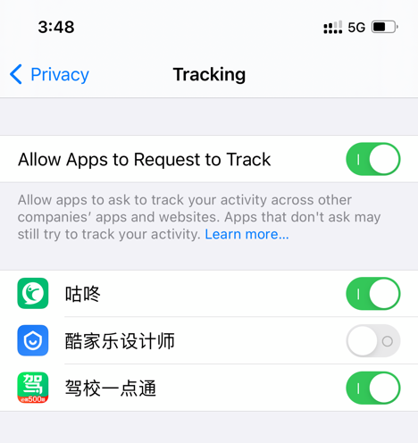
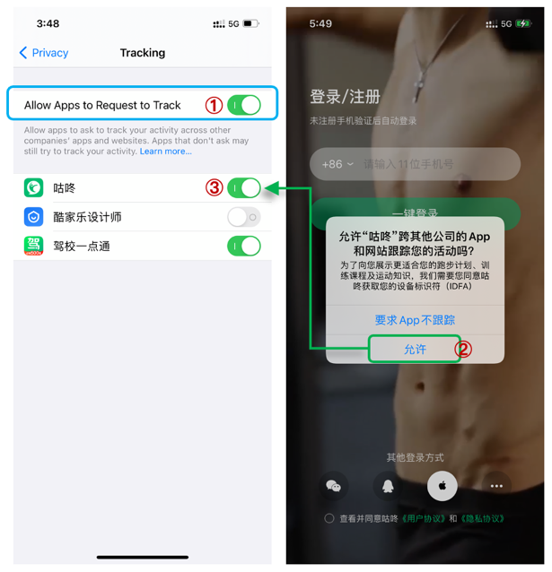
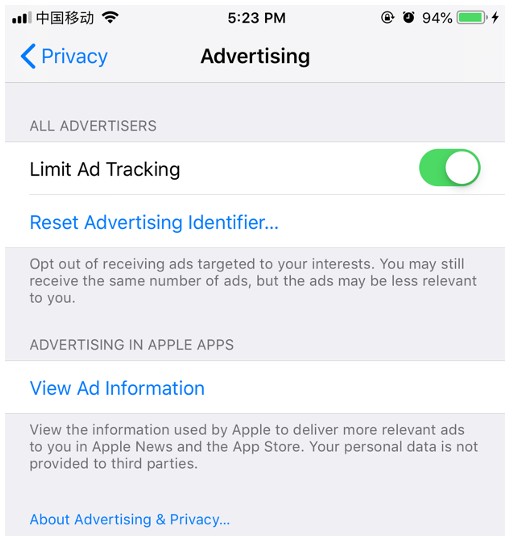

# iOS 和 ASA (Apple Search Ads) 常用名词表

## A

* AAtRtT
  
  Allow Apps to Request to Track（允许 App 请求跟踪），是一个系统级的选项。

  
  
  
  
* AdService Framework

  AdService 是苹果于 2021 年 1 月发布的一个全新的 Apple Search Ads 归因方案。此方案不依赖 IDFA，不受用户隐私政策的影响，在 iOS 14.3 及更高版本的设备上 100% 可成功归因。

  [进一步了解 AdService (英文)](https://developer.apple.com/documentation/adservices)

  

* AppTrackingTransparency（ATT）
  
  App Tracking Tranparency 框架，在 iOS 14、iPadOS 14 和 Apple tvOS 14 中，您需要通过 AppTrackingTransparency 框架弹窗询问征得用户的许可，才能追踪用户或访问用户设备的广告标识符。
  
  

* ASA

  Apple Search Ads

  

## B

* Broad Match

## C

* CPA

* CPA Goal

* CPT

  

## D

## E

* Exact Match

## F

## G

## H

## I

* iAd
* IDFA
* IDFV

## J

## K

## L

* LAT

  Limited Ad Tracking，开启则限制广告跟踪（如下图），系统默认是关闭的。LAT on 用户，指的是限制广告跟踪的用户。
  
  
  
  
  
* Low Volume

## M

* MMP

  Mobile Measurement Provider

## N

## O

- org

  

## P

* Per App Tracking Consent Status

  单个应用程序跟踪同意状态

## Q

## R

* Redownload

## S

* Search Popularity

* SKAdNetwork

  SKAdNetwork 是苹果 2018  年推出的广告归因框架，随着 iOS 14 推出，做了重大更新。它允许已注册的广告网络通过接收来自 Apple 的签名信号，将 app 安装归因于特定营销活动。在保护用户隐私的同时，验证某一个广告触发了多少安装量，并衡量哪些营销活动最为有效。

  [进一步了解 SKAdNetwork (英文)](https://developer.apple.com/documentation/storekit/skadnetwork)

## T

## U

## V

## W

## X

## Y

## Z
